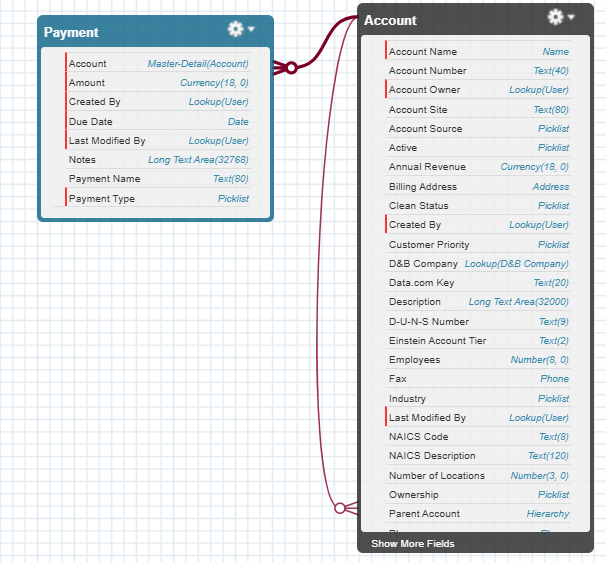
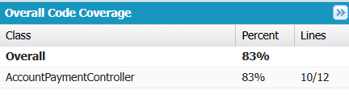
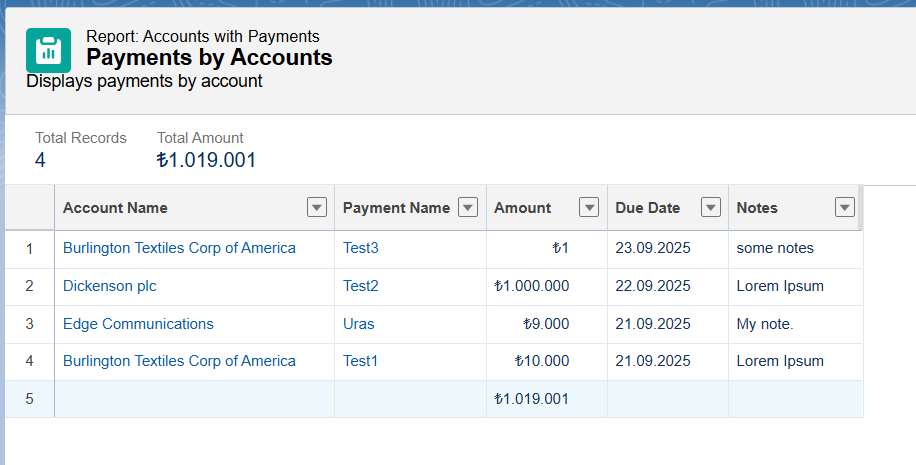
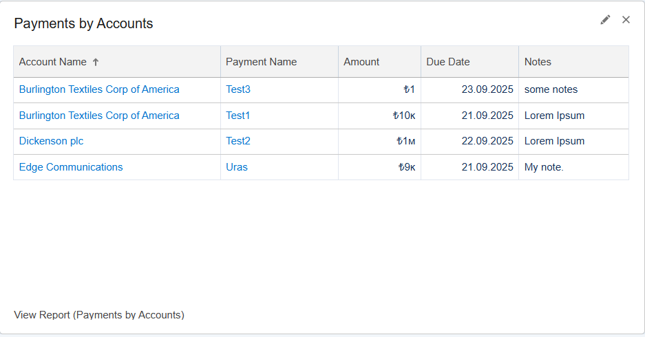

# Account Payments LWC Project

This project implements a custom Salesforce Lightning Web Component (LWC) to display **Accounts** and their related **Payments**, and allows creating new Payment records directly from the UI.  
It also includes Apex controllers, unit tests with >80% coverage, and Reports & Dashboards for visualization.

## 📂 Project Contents
- **Custom Object**: `Payment__c`  
- **Apex Controller**: `AccountPaymentController`  
- **Apex Test Class**: `AccountPaymentController_Test`  
- **LWC Component**: `accountPayments`  
- **Reports**: "Payments by Account Report"  
- **Dashboard**: "Payments Dashboard"

## 🔗 Links
- **GitHub Repository**: [https://github.com/urasylmaz1/Account-Payments-Projects-LWC-Project](https://github.com/urasylmaz1/Account-Payments-Projects-LWC-Project)  
- **Trailhead Profile**: [https://www.salesforce.com/trailblazer/t7akiys40b8tdnu9a6](https://www.salesforce.com/trailblazer/t7akiys40b8tdnu9a6)  

## 🗂️ Object Schema
Below is the schema showing the relationship between **Account** and **Payment__c**:

## 🔗 Relationship Choice: Master-Detail vs Lookup
I chose **Master-Detail** for the `Account - Payment` relationship because:
- Payments cannot exist without an account.  
- Deleting an account automatically deletes its related Payments.  
- Allows use of **roll-up summary fields** (e.g., Total Payment Amount on Account).

## 🧪 Test Coverage
Unit tests were written in `AccountPaymentController_Test`.  

- Coverage: **85%**  
- Example result from Apex Test Execution:

## 📊 Reports
A report was created to analyze Accounts and their Payments:  

- **Report Name**: Payments by Account Report   
- **Fields**: Account Name, Payment Name, Amount, Due Date, Notes  

## 📈 Dashboard
A dashboard was created to visualize Payments data:  

- **Dashboard Name**: Payments Dashboard  
- **Components**:  
  - Donut Chart → Payments by Type  
  - Bar Chart → Total Payment Amount per Account  
  - Line Chart → Payments by Due Date  

## 👥 Contributors
- urasylmaz1@gmail.com
- ydoganci@cyangate.com  
- hbostan@cyangate.com

